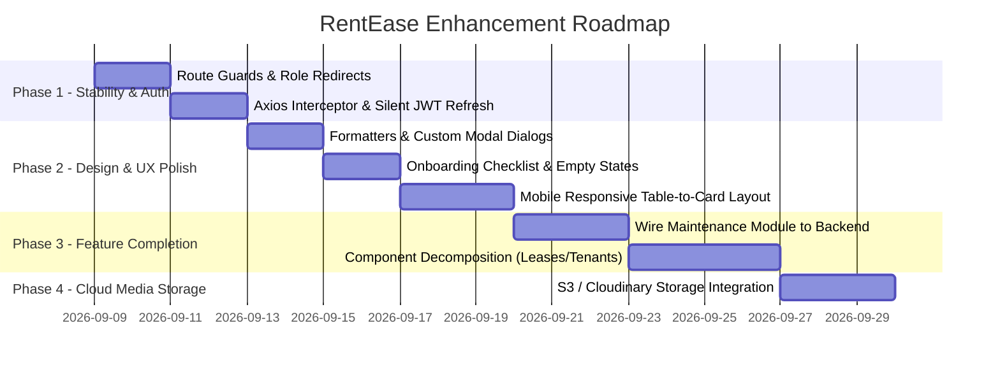

# Product Requirements Document (PRD)

## Project: RentEase — UX/UI, Performance & Architecture Enhancements
**Document Version:** 1.0.0  
**Status:** Ready for Review  
**Target Platform:** Web (Desktop, Tablet, Mobile)  
**Last Updated:** September 2026  

---

## 1. Executive Summary & Objective

**RentEase** is an end-to-end rental property management platform designed for landlords and tenants. It covers portfolio management (buildings, floors, units), tenant management, lease tracking, payment accounting, and automated invoice/receipt generation.

While the core functionality and database schemas are established, this PRD addresses critical user experience (UX) gaps, interface inconsistencies, authentication stability issues, and responsive layout challenges identified during production deployment testing.

### Key Goals:
- **Improve Usability & Onboarding:** Provide zero-to-one guidance for new users with visual empty states and step-by-step onboarding.
- **Ensure Session Continuity:** Eliminate unexpected logouts by implementing automatic background JWT token refresh.
- **Achieve Mobile Usability:** Adapt dense multi-column tabular data into readable card interfaces on handheld devices.
- **Complete In-Flight Modules:** Connect existing backend endpoints (e.g., Maintenance Requests) to eliminate placeholder stubs.
- **Strengthen Data Durability:** Transition ephemeral local media storage to cloud object storage.

---

## 2. Target Personas

### 2.1 The Landlord (Primary Persona)
- **Role:** Independent landlord or commercial property manager managing 5 to 100+ units.
- **Key Needs:**
  - Fast glance at occupancy and cashflow.
  - One-click rent reminders and invoice sharing.
  - Quick tenant onboarding and unit allocation.
  - Seamless mobile access when visiting physical property sites.

### 2.2 The Tenant (Secondary Persona)
- **Role:** Residential or commercial tenant occupying a leased unit.
- **Key Needs:**
  - View rent payment history and upcoming due dates.
  - Download monthly invoices and payment receipts (PDF).
  - Submit maintenance requests and track repair progress.

---

## 3. Scope & Problem Statements

### 3.1 Authentication & Routing
| Issue ID | Problem Description | Impact |
| :--- | :--- | :--- |
| **SEC-01** | Direct URL navigation renders child components before evaluating login state. | Brief UI flicker and layout distortion on unauthenticated visits. |
| **AUTH-01** | JWT access tokens expire without a client-side silent refresh mechanism. | Landlords lose unsaved form data mid-workflow due to unhandled `401 Unauthorized`. |
| **ROLE-01** | No explicit role-based route guard preventing landlords from loading tenant routes or vice versa. | Unexpected views and permission error popups. |

### 3.2 User Interface & Visual Ergonomics
| Issue ID | Problem Description | Impact |
| :--- | :--- | :--- |
| **UI-01** | Side navigation displays active buttons for unimplemented modules (Maintenance, Analytics, Reminders). | User confusion when encountering placeholder stubs. |
| **UI-02** | Tables in Tenants, Leases, and Payments overflow viewports on screens `< 768px`. | Poor mobile usability requiring horizontal scrolling. |
| **UI-03** | Lack of numeric and date localization (`15000` vs `₹15,000`, `2026-09-08` vs `08 Sep 2026`). | Reduced readability in financial data. |
| **UI-04** | Destructive actions (delete building, terminate lease) invoke native browser `window.confirm()`. | Unbranded, easily bypassed, and risk of accidental deletion. |

### 3.3 Infrastructure & Media Persistence
| Issue ID | Problem Description | Impact |
| :--- | :--- | :--- |
| **INF-01** | Uploaded lease PDFs and building photos are saved to container local `/media/`. | On ephemeral container platforms (e.g. Render Free/Starter), files disappear upon container restart. |

---

## 4. Functional Requirements & Specifications

### 4.1 Feature 1: Route Guards & Session Management
- **FR-1.1:** Create a reusable `<ProtectedRoute allowedRoles={['landlord', 'tenant']}>` wrapper in `src/components/ProtectedRoute.jsx`.
  - Check `localStorage` for `access_token` and `user.role`.
  - Redirect unauthenticated sessions to `/login?redirect={currentPath}`.
  - Redirect mismatched roles to their authorized dashboard.
- **FR-1.2:** Implement an Axios response interceptor in `src/api.js`:
  - Intercept `401 Unauthorized` responses.
  - Call `POST /api/auth/refresh/` using `refresh_token`.
  - Upon success, update `localStorage.access_token` and replay failed requests with the new token.
  - Upon refresh failure, clear storage and route to `/login`.

### 4.2 Feature 2: Mobile-Responsive Data Presentation
- **FR-2.1:** For screens under `768px`, automatically swap tables for responsive card list views across:
  - `Leases.jsx` (Tenant avatar, unit badge, dates, rent amount, status chip).
  - `Payments.jsx` (Receipt badge, date, payment method, amount, status chip, PDF download button).
  - `Tenants.jsx` (Contact card with click-to-call and click-to-email actions).
- **FR-2.2:** Form modals (Add Unit, Add Lease, Edit Tenant) must employ full-screen mobile drawers on `< 640px` viewports with sticky action footers.

### 4.3 Feature 3: Onboarding & Empty States
- **FR-3.1:** Display a progressive onboarding widget on `LandlordDashboard.jsx` when `properties.length === 0`:
  ```
  Step 1: Create your first building (Done / Action)
  Step 2: Add units & specify monthly target rents
  Step 3: Add tenant contact details
  Step 4: Create and activate a lease agreement
  ```
- **FR-3.2:** Provide contextual empty states with actionable primary buttons for each sub-page:
  - *No Leases:* "You don't have any active leases yet. Create one to start tracking rent."
  - *No Payments:* "No payment records found for the selected filter."

### 4.4 Feature 4: Custom Design System Components
- **FR-4.1 (Modal Dialog):** Implement `<ConfirmationModal>` replacing `window.confirm()`:
  - Title, description of consequences, cancel button, and danger-styled confirm action.
- **FR-4.2 (Formatters):** Provide standardized utility functions:
  - `formatCurrency(amount)`: Outputs `₹15,000` using `Intl.NumberFormat('en-IN')`.
  - `formatDate(dateString)`: Outputs `08 Sep 2026` and relative indicator (e.g., `Overdue by 3 days`).
- **FR-4.3 (Status Chips):** Standardize badge visual tokens:
  - `Active` / `Paid`: Green badge (`#E6F4EA` bg, `#137333` text).
  - `Pending`: Amber badge (`#FEF7E0` bg, `#B06000` text).
  - `Overdue` / `Terminated`: Red badge (`#FCE8E6` bg, `#C5221F` text).

### 4.5 Feature 5: Connect Maintenance Module
- **FR-5.1:** Activate the `/landlord/maintenance` route:
  - Replace `PagePlaceholder` with a functional `MaintenanceManagement.jsx` page.
  - Connect to existing Django endpoints:
    - `GET /api/maintenance/` — List all requests.
    - `PATCH /api/maintenance/{id}/` — Update status (`submitted` → `in_progress` → `resolved`).
  - Provide filter by building, status, and urgency (`low`, `medium`, `high`, `emergency`).

### 4.6 Feature 6: Persistent Cloud Media Storage
- **FR-6.1:** Configure `django-storages` with AWS S3, Cloudinary, or Supabase Storage:
  - Store uploaded lease agreement PDFs and property photos in cloud storage.
  - Serve media files using signed URLs or CDN endpoints.

---

## 5. Non-Functional Requirements (NFRs)

- **Performance:** Initial JS bundle load time under 1.5s over 4G networks; production bundle gzip size `< 150KB`.
- **Accessibility (a11y):** All input controls and modals must support keyboard navigation (`Tab`, `Esc` to dismiss) and screen-reader accessible labels.
- **Cross-Browser Compatibility:** Tested and supported on Chrome, Safari, Edge, and Firefox (latest 2 versions).
- **Code Maintainability:** Refactor monolith components (`Leases.jsx`, `Tenants.jsx`) into smaller sub-components (`<LeaseTable>`, `<LeaseFormModal>`, `<LeaseFilterBar>`) with max file length `< 500` lines.

---

## 6. Implementation Roadmap & Milestones



| Milestone | Deliverables | Target Timeline |
| :--- | :--- | :--- |
| **Milestone 1: Stability & Security** | `<ProtectedRoute>` implementation, Axios silent JWT refresh, unauthenticated flicker fix. | Week 1 |
| **Milestone 2: Design & Ergonomics** | Indian Rupee currency formatters, date tags, empty states, branded confirmation modal. | Week 2 |
| **Milestone 3: Responsive Experience** | Card views for smartphone screens on Payments, Leases, and Tenants pages. | Week 3 |
| **Milestone 4: Module Activation** | Full Maintenance Management UI connected to Django API; sidebar cleanup. | Week 4 |
| **Milestone 5: Cloud Storage** | Persistent object storage integration for uploaded PDFs and property images. | Week 5 |

---

## 7. Success Metrics & KPIs

1. **Zero Session Dropouts:** 0% form loss reported due to expired JWT authentication tokens.
2. **Reduced Bounce on Signup:** > 75% of newly registered landlords complete at least 1 building and 1 unit within their first session.
3. **Mobile Engagement:** Mobile user session duration and task completion rate on parity with desktop (> 80%).
4. **Error Rate:** 0 unhandled `401` or `500` console exceptions across core CRUD workflows.
